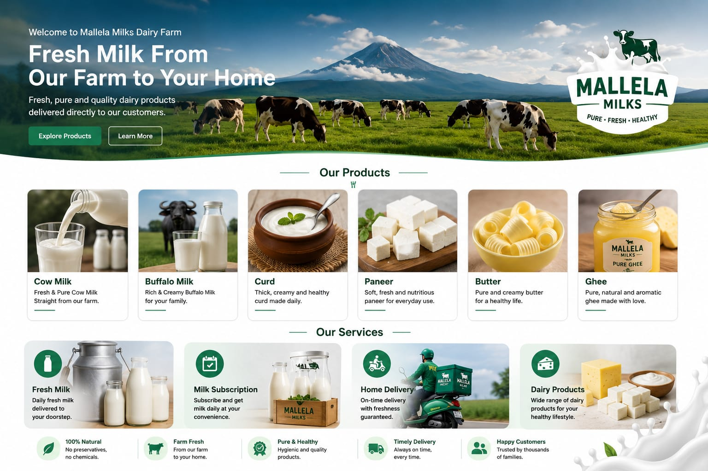

# Mallela Milks 🥛

Mallela Milks is a full-stack dairy e-commerce web application developed as a portfolio project.

The application allows customers to browse dairy products, register/login, add products to a cart, place orders, view previous orders, cancel pending orders, submit reviews, and contact the business.

## 🌐 Live Demo

**Live Website:**  
https://manoj8247.github.io/mallelaproject/

> Note: The project uses free-tier cloud services. The backend and database may take some time to wake up after a period of inactivity.

---

## ✨ Features

### 👤 User Authentication

- User registration
- User login/logout
- Password hashing
- Session-based authentication
- Protected customer operations

### 🥛 Products

- Products are loaded dynamically from the database
- Product name, price, image, and unit are stored in MySQL
- New products can be added or existing products can be modified through the database without changing the frontend

### 🛒 Shopping Cart

- Add products to cart
- Increase/decrease quantity
- Remove products
- Automatic subtotal calculation
- Delivery charge calculation
- Checkout validation

### 📦 Orders

- Place orders
- Store customer and order information in MySQL
- View current orders
- View previous orders
- Cancel orders while they are in `Pending` status
- Order status tracking:
  - Pending
  - Processing
  - Out for Delivery

### ⭐ Reviews

- Logged-in users can submit reviews
- 1–5 star rating system
- Reviews are stored in MySQL
- Newest reviews are displayed first
- View more reviews functionality

### 📩 Contact

- Customers can submit contact messages
- Messages are stored in MySQL

---

## 🛠️ Technologies Used

### Frontend

- HTML5
- CSS3
- JavaScript
- Bootstrap

### Backend

- Python
- Flask
- Flask-CORS
- Gunicorn

### Database

- MySQL
- MySQL Connector/Python

### Security

- Werkzeug password hashing
- Flask sessions
- HTTP-only session cookies
- Production CORS configuration
- Environment variables for sensitive configuration

### Deployment

- GitHub Pages - Frontend
- Render - Flask Backend
- Aiven - MySQL Database

---

## 🏗️ Project Architecture

```text
                 ┌──────────────────────┐
                 │     GitHub Pages     │
                 │   HTML / CSS / JS    │
                 └──────────┬───────────┘
                            │
                            │ REST API
                            ▼
                 ┌──────────────────────┐
                 │       Render         │
                 │   Flask + Gunicorn   │
                 └──────────┬───────────┘
                            │
                            │ MySQL Connection
                            ▼
                 ┌──────────────────────┐
                 │       Aiven          │
                 │    MySQL Database    │
                 └──────────────────────┘
```

---

## 📂 Project Structure

```text
mallelaproject/
│
├── backend/
│   ├── app.py
│   ├── requirements.txt
│   └── .env
│
├── images/
│   └── mallela-milks-preview.png
│
├── index.html
├── mmk.html
├── mmk.css
├── mmk.js
├── product.html
├── product.css
├── product.js
│
├── .gitignore
└── README.md
```

> `.env` contains sensitive configuration and is excluded from Git using `.gitignore`.

---

## 🔌 API Endpoints

### Test Backend

```http
GET /api/test
```

Checks whether the Flask backend and database connection are working.

### Authentication

```http
POST /api/register
POST /api/login
```

### Products

```http
GET /api/products
```

Returns products stored in the MySQL database.

### Orders

```http
POST /api/orders
GET /api/orders/<customer_id>
POST /api/orders/<order_id>/cancel
```

### Reviews

```http
GET /api/reviews
POST /api/reviews
```

### Contact

```http
POST /api/contact
```

---

## 🗄️ Database

The application uses a MySQL database named:

```text
mmk_store
```

Main tables:

```text
customers
products
orders
order_items
reviews
contact_messages
```

### Database Relationship Overview

```text
customers
    │
    ├────────── orders
    │              │
    │              └──────── order_items
    │
    └────────── reviews

contact_messages
```

---

## 🔐 Environment Variables

Sensitive configuration is stored in environment variables.

Example:

```env
DB_HOST=
DB_USER=
DB_PASSWORD=
DB_NAME=
DB_PORT=
SECRET_KEY=
FLASK_ENV=
FRONTEND_URL=
```

Actual credentials are **not stored in the GitHub repository**.

---

## 🚀 Running Locally

### 1. Clone the repository

```bash
git clone https://github.com/Manoj8247/mallelaproject.git
```

```bash
cd mallelaproject
```

### 2. Create a virtual environment

```bash
python -m venv venv
```

### 3. Activate the virtual environment

#### Windows

```bash
venv\Scripts\activate
```

#### Linux / macOS

```bash
source venv/bin/activate
```

### 4. Install dependencies

```bash
pip install -r backend/requirements.txt
```

### 5. Configure environment variables

Create:

```text
backend/.env
```

and add the required database and Flask configuration.

### 6. Start the Flask backend

```bash
python backend/app.py
```

For production-style execution:

```bash
gunicorn --bind 0.0.0.0:$PORT app:app
```

### 7. Open the frontend

Open `index.html` using a local development server such as VS Code Live Server.

---

## ☁️ Deployment

The project is deployed using three services:

| Component | Platform |
|---|---|
| Frontend | GitHub Pages |
| Backend | Render |
| Database | Aiven MySQL |

### Frontend

https://manoj8247.github.io/mallelaproject/

### Backend

https://mallela-milks-backend.onrender.com

The frontend communicates with the Flask backend through REST API requests.

---

## 💰 Free-Tier Deployment

This project currently uses free-tier cloud services for demonstration and portfolio purposes.

Because free-tier services can sleep after periods of inactivity, the first request after inactivity may take longer than normal.

The application is currently intended as a:

- Portfolio project
- Recruiter demonstration
- Learning project
- Full-stack development showcase

It is not currently intended for real commercial production use.

---

## 🔒 Security Considerations

The application includes:

- Password hashing
- Session-based authentication
- Protected order operations
- Protected review submission
- Environment variables for database credentials
- Production CORS configuration
- HTTP-only session cookies

Additional security hardening would be required before using the application for a real commercial business.

---

## 📚 What I Learned

Through this project, I worked with:

- Frontend development
- JavaScript API integration
- Flask REST APIs
- MySQL database design
- SQL queries
- User authentication
- Session management
- CRUD operations
- Shopping cart logic
- Order management
- Database relationships
- Git and GitHub
- Environment variables
- Cloud deployment
- GitHub Pages
- Render
- Aiven MySQL
- Connecting a deployed frontend, backend, and database

---

## 📌 Project Status

**Currently deployed and available as a live demonstration.**

The project will continue to be improved with additional features, security enhancements, and UI improvements.

---

## 📸 Project Preview



---

## 👨‍💻 Author

**Manoj Kumar**

Computer Science Engineering Student
